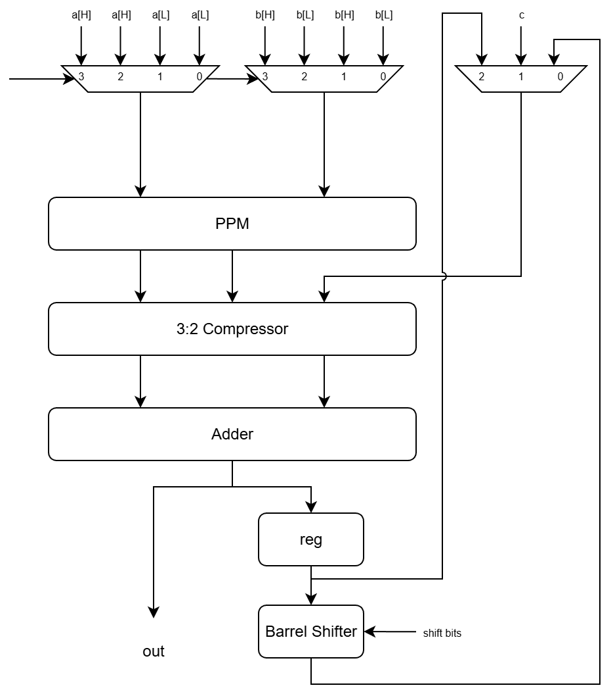

# FB32DSP Documentation

## Overview
FB32DSP involves a feedback loop, making it simple and efficient. However, the operating frequency is limited by this loop.

This is a parametric Folded DSP design. The width `N` is configurable (must be odd).

## Supported Operations
- **1-cycle Operations:**
  - N/2 x N/2 + N Multiply-Add
  - N/2 x N/2 Multiply-Accumulate

- **2-cycle Operations:**
  - N/2 x N + N Multiply-Add
  - N/2 x N Multiply-Accumulate

- **4-cycle Operations:**
  - N x N + N Multiply-Add
  - N x N Multiply-Accumulate

*Note: In the examples above, `N` refers to the parametric width.*

## Features
- **Barrel Shifter**: Built-in barrel shifter for MAC operations.
- **Constraints**: N should be an odd number (e.g., 33).
