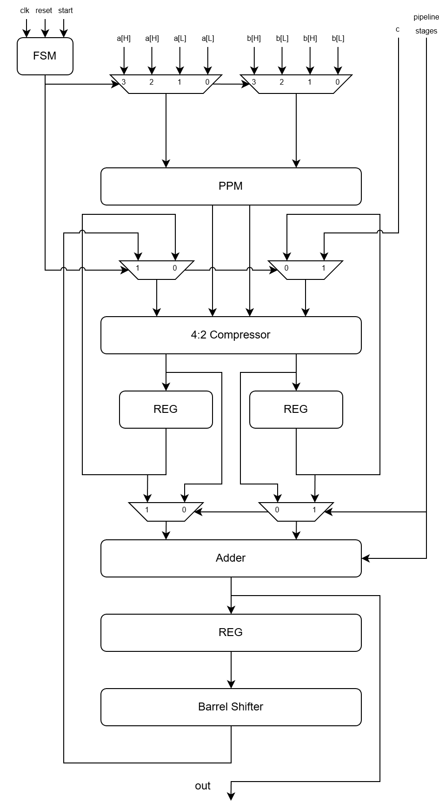

# FF42DSP Documentation

## Overview

This is a parametric Folded DSP design. The width `N` is configurable (must be odd).

## Supported Operations
- **1-cycle Operations:**
  - N/2 x N/2 + 2N Multiply-Add
  - N/2 x N/2 Multiply-Accumulate
  - N bit Accumulate

- **2-cycle Operations:**
  - N/2 x N + 2N Multiply-Add
  - N/2 x N Multiply-Accumulate

- **4-cycle Operations:**
  - N x N + 2N Multiply-Add
  - N x N Multiply-Accumulate

## Features
- **Pipelining**: Supports pipelining the final addition. Number of stages = 2^`pipeline_stages`.
- **Barrel Shifter**: Included for efficient data manipulation in MAC operations (Arithmetic Right Shift only).
